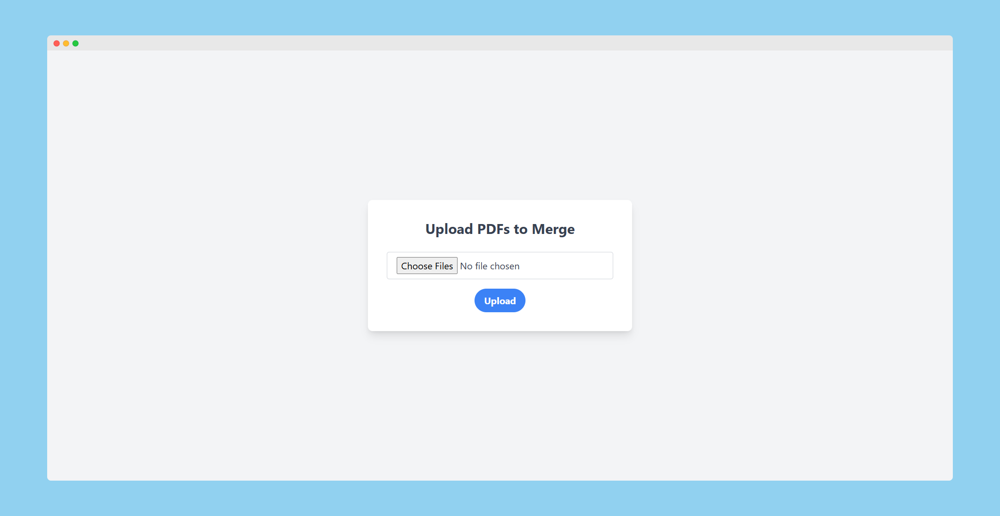

# Flask PDF Merger

A self hostable web-based PDF merging application built with Flask. This app allows users to upload multiple PDF files, select the files they want to combine, reorder them, and download the merged result.



## Features

1. **Upload Multiple Files**: Upload multiple PDF files for merging.
2. **Select and Order Files**: Choose the files you want to merge and reorder them as needed.
3. **Download Merged PDF**: Combine selected files and download the merged PDF.

## Tech Stack

- **Flask** - Web framework
- **PyPDF2** - PDF merging
- **Tailwind CSS** - Styling
- **FontAwesome** - Icons

## Installation

1. **Clone the repository**:
    ```bash
    git clone https://github.com/tshenolo/flask-pdf-merger.git
    cd flask-pdf-merger
    ```

2. **Install dependencies**:
    ```bash
    pip install -r requirements.txt
    ```

3. **Run the app**:
    ```bash
    python app.py
    ```

The application will be accessible at `http://127.0.0.1:5000`.

## Docker

To run the application in a Docker container:

1. **Build the Docker image**:
    ```bash
    docker build -t flask-pdf-merger .
    ```

2. **Run the Docker container**:
    ```bash
    docker run -d -p 5000:5000 --name flask-pdf-merger flask-pdf-merger
    ```

The application will be accessible at `http://localhost:5000`.

## Usage

1. Go to the upload page and upload PDF files.
2. Select the files to combine and arrange them in the desired order.
3. Click "Combine Selected" to download the merged PDF.

## Contributing
1. Fork the repository.
2. Create a new branch (git checkout -b feature-branch).
3. Commit your changes (git commit -am 'Add new feature').
4. Push to the branch (git push origin feature-branch).
5. Create a new Pull Request.

## License

This project is licensed under the MIT License.